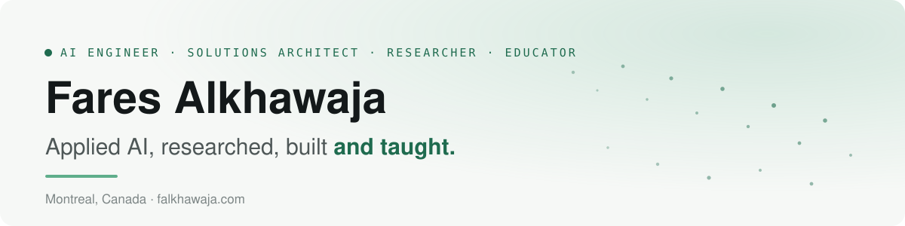

### Three roles, one practice

I work where research, production engineering and teaching meet, and each one makes the others better.

| | |
| --- | --- |
| 🔬 **Research** | PhD, Concordia University (FRQNT). The Nested Dirichlet Distribution for interpretable hierarchical models; 10 peer-reviewed papers (IEEE, Springer, ICONIP); reviewer for NeurIPS, AAAI and ICONIP. |
| 🏗️ **Production** | AI Engineering Advisor at Desjardins. Agentic RAG and multi-agent systems, API gateways and secure AI environments, data pipelines and cloud architecture on Azure, AWS and GCP. |
| 🎓 **Teaching** | Computer science instructor at Vanier College; ten institutions in all, from robotics for kids to MLOps, Kubernetes and neural-network labs. |

### Projects

| Project | What it does | Stack |
| --- | --- | --- |
| [qa-over-company-policies](https://github.com/Alkhawaja/qa-over-company-policies) | Ask questions over policy PDFs, answered with citations (RAG) | FastAPI · pgvector · Gemini |
| [resume-job-match-copilot](https://github.com/Alkhawaja/resume-job-match-copilot) | Resume vs. job post: match score, skill gaps, tailored bullets | FastAPI · Gradio · PostgreSQL |
| [ai-customer-support-inbox](https://github.com/Alkhawaja/ai-customer-support-inbox) | Support inbox with AI triage, reply suggestions and SLA tracking | NestJS · MongoDB · React |
| [call-transcription-analyzer](https://github.com/Alkhawaja/call-transcription-analyzer) | Call transcription, sentiment and action items | .NET · PostgreSQL · Gemini |
| [fraud-signal-dashboard](https://github.com/Alkhawaja/fraud-signal-dashboard) | Real-time transaction risk scoring and alerts | .NET · SQL Server |
| [iot-predictive-maintenance](https://github.com/Alkhawaja/iot-predictive-maintenance) | Sensor anomaly detection and failure prediction | Python · TimescaleDB |
| [personal-knowledge-hub](https://github.com/Alkhawaja/personal-knowledge-hub) | Notes with embedding-based tags and semantic search | NestJS · React |
| [ai-study-planner](https://github.com/Alkhawaja/ai-study-planner) | AI study plans with spaced repetition and quizzes | TypeScript · Gemini |
| [smart-expense-classifier](https://github.com/Alkhawaja/smart-expense-classifier) | Expense categorization with a lightweight ML model | scikit-learn · FastAPI |
| [SHI_LNDA](https://github.com/Alkhawaja/SHI_LNDA) | Research code: hierarchical topic selection for Latent Nested Dirichlet Allocation | Python |

### Selected publications

- **Simultaneous Hierarchical Topic Selection and Initialization for Latent Nested Dirichlet Allocation**. *Applied Artificial Intelligence*, 2026.
- **Adaptive Weighted Federated Domain Adaptation Methods for Nonintrusive Load Monitoring**. *IEEE Transactions on Human-Machine Systems*, 2025.
- **Unsupervised Nested Dirichlet Finite Mixture Model for Clustering**. *Applied Intelligence (Springer)*, 2023.
- **Low-Cost Depth/IMU Intelligent Sensor Fusion for Indoor Robot Navigation**. *Robotica*, 2023.

All papers on [Google Scholar](https://scholar.google.com/citations?user=o2ZckiAAAAAJ) and [falkhawaja.com](https://falkhawaja.com/#publications).

### Toolbox

### Get in touch

Questions about a course, tutoring, research collaboration or an AI project? Write to me through the [contact form on falkhawaja.com](https://falkhawaja.com/#contact). English or French.
